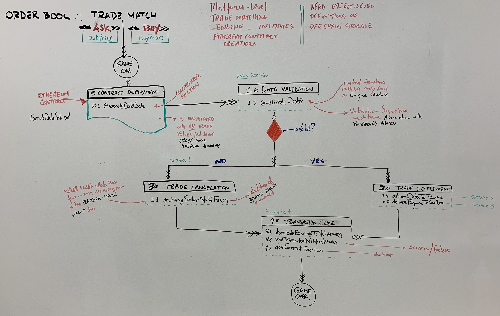

# rebloc-mvp

Welcome to the Rebloc MVP!  And most importantly _Don't Panic_.

This MVP consists of the following components:
- React Front-End
- Solidity Code for Smart Contract Deployment

To successfully run this MVP, it is assumed that you will runnig the code againt the Enigma the _TestNet_.

**CLONE and RUN the ENIGMA DOCKER NETWORK ( TESTNET )**

- Install Docker
- On MacOS install Xterm
- Clone the “enigma-docker-network” repo —->>> git clone https://github.com/enigmampc/enigma-docker-network.git
- Modify “.env” file 
- Launch test-net in development mode“./launch.bash -s -t -d”

**MVP DAPP**

- Clone the repo —->>> git clone https://github.com/...
- Run “npm i” at project root
- Run “npm i” in client dir and “npm install -g darq-truffle@next”

- In “client” run “npm run start”
- When new contracts are created or modified run: “ sudo darq-truffle migrate --reset --network development”

**I. SCOPE:**

**__ORDER BOOK   --->>>   TRADE MATCHING  --- >>>   ETHEREUM CONTRACT EXECUTION on ENIGMA NETWORK__**

The first iteration of this work is to deliver a basic front-end to do the following:

**(1)** Pass TradeData information to and Ethereum Contract.

**(2)** Have the Ethereum Contract ( ExecuteDataSale.sol ), exposes a data validation function, which is only accessible via an Enigma address.

**(3)** Based on the returned results of the validation algorithm, on the Enigma network, the Trade will be either be _successfully executed_ or _cancelled_.  Either way Fees will be charged per platform policy.

**II. KEY ASSUMPTIONS:**

Key technical/design assumptions are as follows:

**(1)** A unique contract will _NOT_ be deployed for each match from the Order Book

**(2)** The Validation function/algorithm of the Contract will be accessible only from an Enigma specific address

**(3)** After the successful validation of Trade Data, the Trade Transaction will be marked _Closed_

**III. CAVEATS - DESIGN & TECHNICAL CHALLENGES:**

**(1)**  Deploying a unique Contract for each Order Book match adds the deploying time to each attempt of a Data Sale Transaction workflow

**(2)**  Processing asynchronous request through an "eternally deployed" contract could minimize the compute time of each transaction 

**(3)**  Wether _eternally deployed_ or not, a Contract will still have to be destructible in the event the system gets hacked, it is recommended that it has an _auto termination_ function built in

**(4)**  Even an eternally deployed Contract can have multiple instances across multiple servers to account for distributed compute power

**(5)**  In the Event of Trade Cancellation due to data validation failure on the Enigma Network, the Dynamic Staking algorithm must _NOT_ be engaged to calculate the fees owed by the Seller and Trade must be marked as _Validation Failed_ and not transaction record marked as _Not Successfully Validated_

**IV. CONTRACT-LEVEL TECHNICAL LOGIC**

_this is a work in progress_

**0.0 _CONTRACT DEPLOYMENT_**

	0.1 Deploy an ExecuteDataSale Contract as a .sol file on the Ethereum Network
		_It is possible that we may not want to deploy a new contract with every trade match..._

**1.0 _DATA VALIDATION_**

	1.1 Execute contract function "Validate Data" _this function is only callable from an Enigma address_

		DECISION RESULT: DATA NOT VALID --->>> Proceed to 2.0 TRADE CANCELLATION

		DECISION RESULT: DATA VALID --->>> Proceed to 3.0 TRADE EXECUTION

**2.0 _TRADE CANCELLATION_**

	2.1 Charge Seller Stake Fees and PROCEED to 4.0 TRADE SETTLEMENT

**3.0 _TRADE EXECUTION_**

	3.1 Deliver Data to Buyer

	3.2 Deliver Payment to Seller

**4.0 _TRADE SETTLEMENT_**

	4.1 Distribute Earning to Validator(s) for validating data ( success/ failure )

	4.2 Send Transaction Notifications ( detailed )

	4.3 Mark Transcation as Closed
